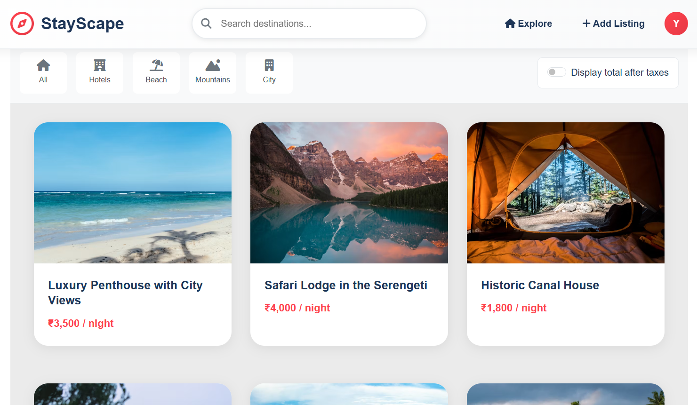
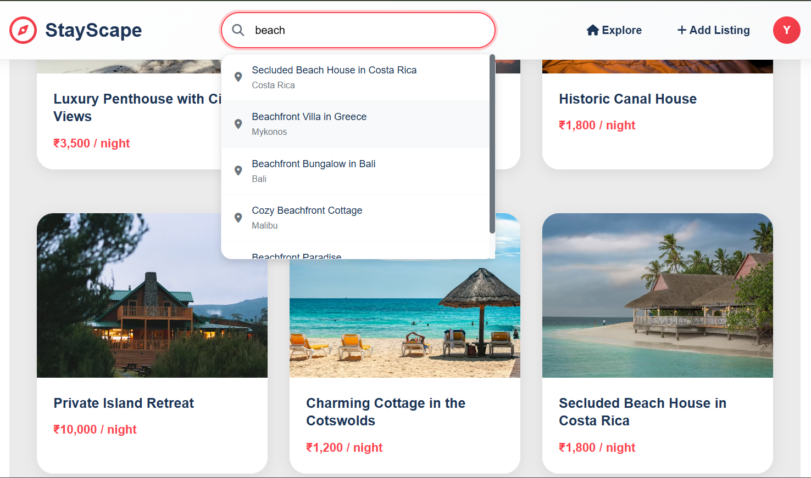
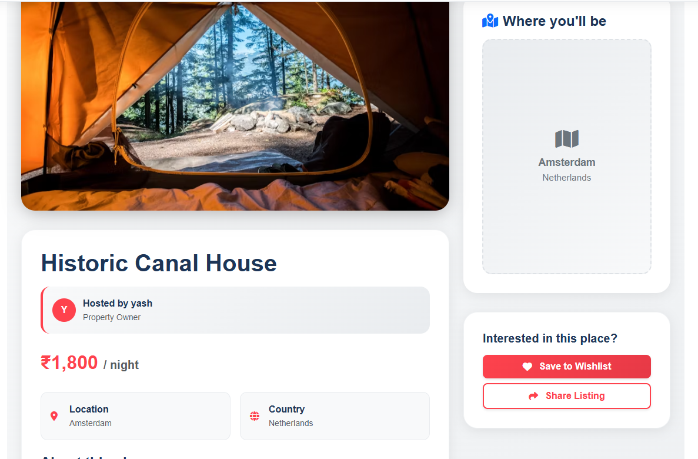
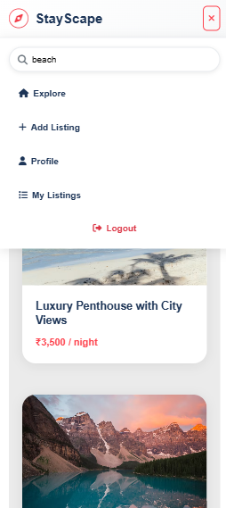
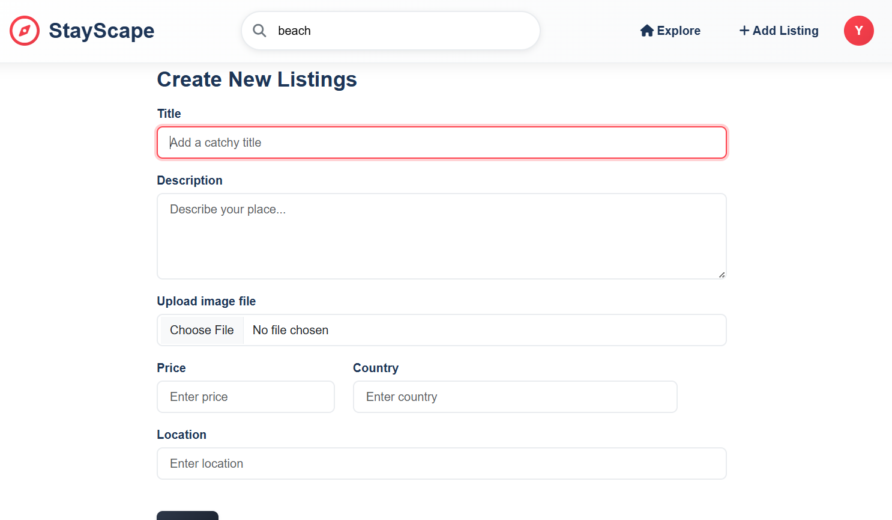

# 🏠 StayScape - Modern Vacation Rental Platform

<div align="center">


**A sleek, modern vacation rental platform built with the MERN stack**

[](your-render-url-here)
[](LICENSE)
[](https://nodejs.org/)
[](https://reactjs.org/)

</div>

---

## 📸 Screenshots

### Homepage with Smart Search

*Clean, minimal interface with intelligent search suggestions*

### Search Results with Filters

*Real-time search with 500ms debounced suggestions*

### Property Listing Detail

*Detailed property information with reviews*

### Mobile Responsive Design

*Fully responsive across all devices*

### Add New Property

*Simple and intuitive property listing creation*

---

## ✨ Key Features

### 🔍 **Smart Search System**
- **Real-time suggestions** with 500ms debouncing
- **Intelligent filtering** by title, location, and description
- **Instant results** with smooth user experience

### 🎨 **Minimalist Design**
- **Clean, modern UI** inspired by contemporary design principles
- **Simplified navigation** for better user experience
- **Responsive design** that works on all devices

### 🔐 **Secure Authentication**
- JWT-based authentication with secure token management
- Protected routes and user session handling
- Password encryption with bcryptjs

### 🏠 **Property Management**
- Create, edit, and delete property listings
- Image upload with Cloudinary integration
- Real-time availability updates

### ⭐ **Review & Rating System**
- Star-based rating system
- User reviews with full CRUD operations
- Review moderation for property owners

### 📱 **Modern User Experience**
- Single Page Application (SPA) with React
- Smooth animations and transitions
- Loading states and error handling
- Mobile-first responsive design

---

## 🛠️ Technology Stack

<div align="center">

| Frontend | Backend | Database | Cloud Services |
|----------|---------|----------|----------------|
|  |  |  |  |
|  |  |  |  |
|  |  | | |
|  |  | | |

</div>

### Frontend
- **React 18** with Vite for blazing fast development
- **React Router DOM** for seamless navigation
- **Axios** with interceptors for API communication
- **Bootstrap 5** for responsive styling
- **Font Awesome** for modern icons

### Backend
- **Node.js & Express.js** for robust server architecture
- **MongoDB & Mongoose** for flexible data storage
- **JWT** for secure authentication
- **Multer & Cloudinary** for image handling
- **Joi** for data validation

---

## 🚀 Quick Start

### Prerequisites
- Node.js (v20.11.0+)
- MongoDB Atlas account or local MongoDB
- Cloudinary account for image storage

### Installation

1. **Clone the repository**
   ```bash
   git clone https://github.com/yourusername/stayscape.git
   cd stayscape
   ```

2. **Install dependencies**
   ```bash
   # Install all dependencies (client + server)
   npm run install-all
   ```

3. **Environment Setup**
   
   Create `server/.env`:
   ```env
   # Database
   ATLASDB_URL=your_mongodb_connection_string
   
   # JWT Configuration
   JWT_SECRET=your_super_secret_jwt_key
   JWT_EXPIRE=7d
   
   # Cloudinary Configuration
   CLOUD_NAME=your_cloudinary_cloud_name
   CLOUD_API_KEY=your_cloudinary_api_key
   CLOUD_API_SECRET=your_cloudinary_api_secret
   
   # Server Configuration
   PORT=5000
   NODE_ENV=development
   CLIENT_URL=http://localhost:5173
   ```

4. **Run the application**
   ```bash
   # Terminal 1: Start backend server
   npm run server
   
   # Terminal 2: Start frontend server  
   npm run client
   ```

5. **Access the app**
   - Frontend: `http://localhost:5173`
   - Backend API: `http://localhost:5000`

---

## 📁 Project Structure

```
StayScape/
├── 📁 client/                    # React Frontend
│   ├── 📁 public/
│   ├── 📁 src/
│   │   ├── 📁 components/        # Reusable components
│   │   │   ├── Navbar.jsx        # Navigation with search
│   │   │   ├── Footer.jsx        # Site footer
│   │   │   ├── LoadingSpinner.jsx
│   │   │   └── ...
│   │   ├── 📁 pages/             # Page components
│   │   │   ├── ListingsIndex.jsx # Main listings page
│   │   │   ├── ListingShow.jsx   # Property details
│   │   │   └── ...
│   │   ├── 📁 context/           # React Context
│   │   │   └── AuthContext.jsx   # Authentication state
│   │   ├── 📁 services/          # API services
│   │   │   └── api.js            # Axios configuration
│   │   └── 📁 assets/            # Styles and images
│   └── package.json
├── 📁 server/                    # Express Backend
│   ├── 📁 controllers/           # Route handlers
│   │   ├── listing.js
│   │   ├── user.js
│   │   └── reviews.js
│   ├── 📁 models/                # Database schemas
│   │   ├── listing.js
│   │   ├── user.js
│   │   └── reviews.js
│   ├── 📁 routes/                # API routes
│   ├── 📁 middleware/            # Custom middleware
│   ├── 📁 utils/                 # Utility functions
│   └── app.js                    # Express app setup
├── package.json                  # Root package.json
└── README.md
```

---

## 🌐 Deployment

### Deploy to Render (Recommended)

#### Option 1: Separate Services (Recommended)

**Backend Service:**
```bash
# Build Command
cd server && npm install

# Start Command  
cd server && npm start
```

**Frontend Static Site:**
```bash
# Build Command
cd client && npm install && npm run build

# Start Command
cd client && npm run preview
```

#### Option 2: Monorepo Deployment

```bash
# Build Command
npm run build-all

# Start Command  
npm start
```

### Environment Variables for Production
```env
NODE_ENV=production
ATLASDB_URL=your_mongodb_atlas_url
JWT_SECRET=your_production_jwt_secret
CLOUD_NAME=your_cloudinary_cloud_name
CLOUD_API_KEY=your_cloudinary_api_key
CLOUD_API_SECRET=your_cloudinary_api_secret
CLIENT_URL=https://your-frontend-url.onrender.com
PORT=10000
```

---

## 🔧 API Documentation

### Authentication Endpoints
```http
POST /api/users/signup     # Register new user
POST /api/users/login      # User login
POST /api/users/logout     # User logout
GET  /api/users/me         # Get current user profile
```

### Listings Endpoints
```http
GET    /api/listings           # Get all listings (with search)
GET    /api/listings/:id       # Get single listing
POST   /api/listings           # Create listing (auth required)
PUT    /api/listings/:id       # Update listing (auth required)
DELETE /api/listings/:id       # Delete listing (auth required)
```

### Reviews Endpoints
```http
POST   /api/listings/:id/reviews        # Add review (auth required)
DELETE /api/listings/:id/reviews/:rid   # Delete review (auth required)
```

### Search Parameters
```http
GET /api/listings?search=beach    # Search by keyword
```

---

## 🎯 Key Features Explained

### Smart Search with Suggestions
- **500ms debounced search** prevents excessive API calls
- **Client-side filtering** for instant results
- **Auto-suggestions dropdown** with property titles and locations
- **Responsive design** works on mobile and desktop

### Minimalist UI Design
- **Clean typography** with Plus Jakarta Sans font
- **Reduced visual clutter** with simplified filters
- **Consistent spacing** and modern color palette
- **Mobile-first approach** ensures great mobile experience

### Secure Authentication
- **JWT tokens** with automatic renewal
- **Protected routes** with React Router
- **Secure password hashing** with bcryptjs
- **Session management** with localStorage

---

## 🤝 Contributing

1. Fork the repository
2. Create your feature branch (`git checkout -b feature/AmazingFeature`)
3. Commit your changes (`git commit -m 'Add some AmazingFeature'`)
4. Push to the branch (`git push origin feature/AmazingFeature`)
5. Open a Pull Request

---

## 📄 License

This project is licensed under the MIT License - see the [LICENSE](LICENSE) file for details.

---

## 🙏 Acknowledgments

- **Design Inspiration**: Modern vacation rental platforms
- **Icons**: Font Awesome
- **Images**: Cloudinary for image optimization
- **Hosting**: Render for reliable deployment

---

## 📞 Contact

**Your Name** - [@yourtwitter](https://twitter.com/yourtwitter) - your.email@example.com

**Project Link**: [https://github.com/yourusername/stayscape](https://github.com/yourusername/stayscape)

**Live Demo**: [https://stayscape.onrender.com](https://stayscape.onrender.com)

---

<div align="center">

**⭐ Star this repo if you find it useful!**

Made with ❤️ and ☕ 

</div> 
